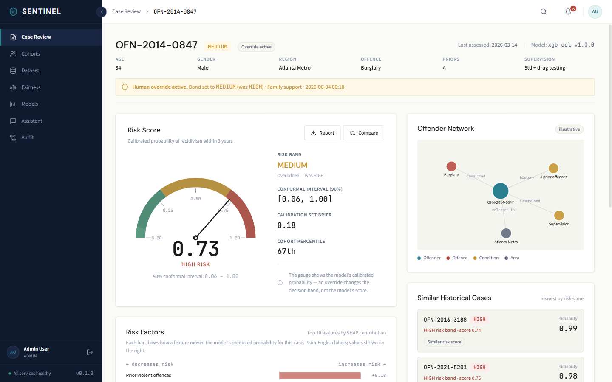
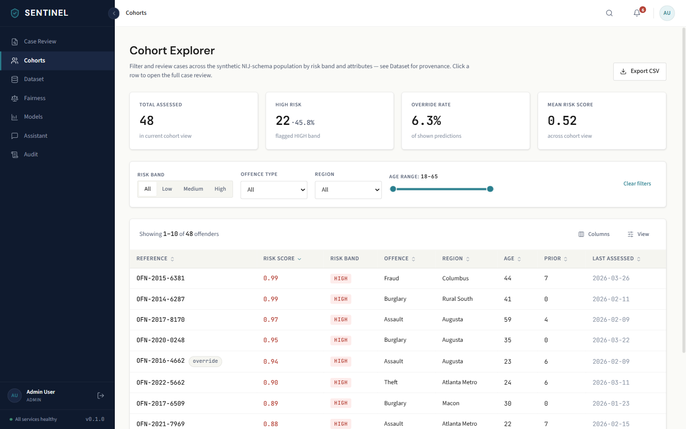
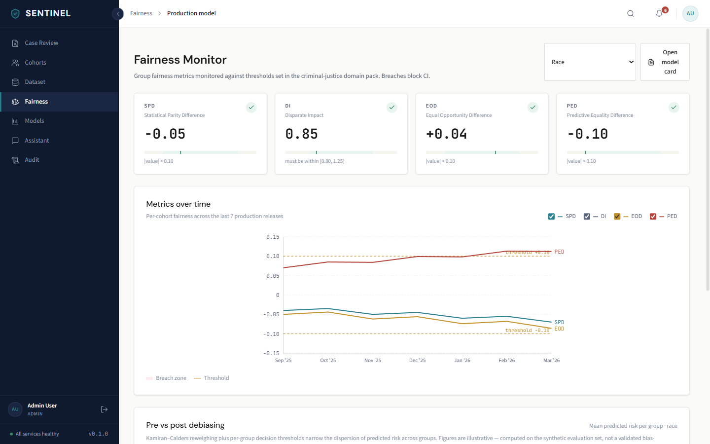
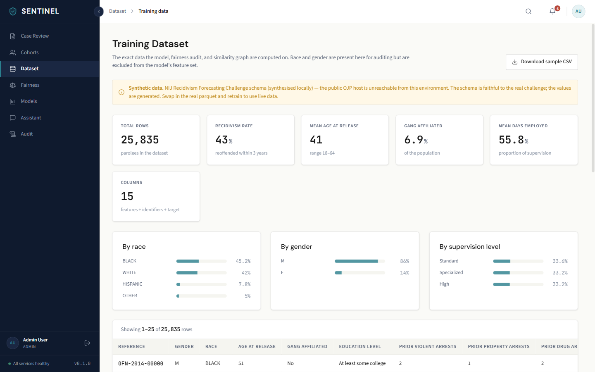

<div align="center">

# SENTINEL

**Secure, Ethical, and Navigable Tool for Intelligent Evaluation of Likelihood**

An open-source **reference implementation** for fairness-aware recidivism risk assessment — calibrated
prediction, knowledge-graph reasoning, and retrieval-augmented assistance, built around fairness
constraints, uncertainty, explainability, and human-in-the-loop oversight.

</div>

---

> **Responsible-use note.** SENTINEL is a research and educational reference implementation. It is
> **not** a validated, production-ready system and **must not** be used to make real decisions about
> any individual. Risk scores are **advisory** model probabilities, never verdicts; a trained human
> always makes the final decision. Every metric here is computed on **synthetic** data (see below),
> not on real people or real reoffence outcomes.

## Why SENTINEL exists

Algorithmic risk assessment is already used across criminal-justice systems, and it has a documented
history of encoding and amplifying bias — the COMPAS controversy being the best-known example. SENTINEL
is a reference implementation of how such a system *should* be approached if it is built at all: every
prediction is calibrated and carries an uncertainty interval, every model is audited for fairness before
it can ship, every output is explainable, every consequential action is logged, and **a human makes the
final decision**. The risk score is decision-support — advisory, never punitive.

**On the data.** SENTINEL targets the schema of the **NIJ Recidivism Forecasting Challenge** (~26,000
Georgia parolees, published by the U.S. National Institute of Justice). The public NIJ host is currently
unreachable from the build environment, so the pipeline trains on a **synthetic** dataset (~25,835 rows)
that reproduces the NIJ feature schema and an illustrative *proxy-mediated* demographic disparity — race
is excluded from the features yet leaks through correlated proxies (the canonical "unawareness is not
enough" failure). **Every number in this project is computed on that synthetic data.** The contribution
is the methodology, not the figures.

## What it does

- **Calibrated risk prediction** — a single XGBoost classifier, Platt-scaled on a held-out split and
  explained per prediction with **exact** TreeSHAP contributions, served behind a FastAPI service. A
  single tree model is deliberate: it keeps the explanation faithful to the served score (a stacked
  ensemble's attributions would not decompose the final probability). Each score carries a
  **split-conformal** uncertainty interval (~90% marginal coverage), so the output is a probability with
  honest error bars, not a false point estimate.
- **Fairness as a working gate** — race and gender are excluded from the feature set, yet a Fairlearn
  audit shows the unmitigated model still discriminates via proxy features. The pipeline then mitigates
  (Kamiran–Calders reweighing plus per-group decision thresholds) and re-audits. Four metrics per group
  (SPD, disparate impact, EOD, PED), a before/after comparison, and a **CI gate**
  (SPD < 0.10, DI ∈ [0.80, 1.25], |EOD|, |PED| ≤ 0.10) that blocks releases breaching them.
- **Human-in-the-loop workflow** — officers review predictions and can override the risk band with a
  mandatory reason code. An override is the final decision: it updates the case view and is recorded,
  alongside every prediction, in a Postgres-backed audit trail. The model's score is never altered by an
  override — both the model's view and the human's decision are preserved.
- **Transparent training data** — a Dataset view exposes the exact (synthetic) rows the model, fairness
  audit, and graph are computed on, clearly labelled as synthetic, so reviewers can inspect what the
  model learned from rather than taking the dashboard on trust.
- **Authentication & RBAC** — JWT (access + refresh with rotation), bcrypt passwords, three roles,
  per-endpoint rate limits, an env-driven CORS allowlist, fail-loud secret checks in production, and an
  httpOnly refresh cookie so sessions survive a page refresh without storing tokens in the browser.
- **Knowledge graph** (`services/graph`) — a Neo4j k-nearest-neighbour "similar offenders" graph with
  Louvain communities, PageRank and degree centrality precomputed by `pipelines/graph_build.py`, served
  via `GET /features/{id}` and `/neighborhood/{id}`.
- **RAG assistant** (`services/agent`) — a PydanticAI agent with **structured output** (never free-text
  parsed) over a hybrid retriever (dense embeddings + BM25 + HyDE + reciprocal-rank fusion + a
  cross-encoder reranker) and two tools: `policy_search` (the domain pack) and `risk_lookup` (the predict
  model). It is instructed to answer **only** from retrieved passages and to say when it cannot — it does
  not invent facts. The LLM is pluggable: self-hosted Ollama (`qwen2.5`), Groq, or the Anthropic API,
  selected by env.
- **Institutional-grade UI** — a responsive React dashboard (Case Review, Cohorts, Dataset, Fairness,
  Models, Assistant, Audit) designed for data-literate professionals making consequential decisions:
  data-dense, no decoration, every score paired with its uncertainty and its human-review caveat.

## Screenshots

| Case review — score, uncertainty, SHAP, override | Cohort triage |
|---|---|
|  |  |
| **Fairness audit — before/after mitigation** | **Training data (synthetic)** |
|  |  |

## Architecture

FastAPI microservices behind a Traefik gateway, with a React SPA served by nginx:

| Service | Port | Responsibility |
|---|---|---|
| `predict` | 8000 | Inference, exact TreeSHAP, calibration + conformal intervals, fairness audit + mitigation, **auth (JWT + RBAC)**, override/audit/dataset APIs |
| `agent` | 8001 | PydanticAI RAG assistant — hybrid retrieval (Qdrant + BM25 + HyDE + rerank) + risk/graph tools, structured output |
| `graph` | 8002 | Neo4j knowledge graph — Cypher query library, community/centrality features |
| `frontend` | 80 | React SPA (nginx) |

Shared infrastructure: PostgreSQL, Qdrant, Neo4j, Ollama (self-hosted LLM + embeddings — inference can
stay entirely local and private), MLflow.

A pluggable **domain-pack** architecture keeps the platform core domain-agnostic; the criminal-justice
pack lives under `domain_packs/criminal_justice/` and is loaded by config, never imported by name.

## Quick start

```bash
cp .env.example .env          # set a real JWT_SECRET; ENVIRONMENT=production on any public deploy
docker compose up -d --build  # core stack: traefik + frontend + predict + postgres
# open http://localhost  → log in with a demo account
```

Demo accounts (password `sentinel-demo-2026`): `admin`, `analyst`, `officer` (`analyst` is read-only and
cannot override). The full stack — assistant, graph, and their datastores — runs behind a profile:

```bash
docker compose --profile full up -d   # adds agent, graph, neo4j, qdrant, ollama, mlflow
```

The trained model and the synthetic dataset are committed, so a fresh clone runs in `trained` mode out of
the box. To regenerate them:

```bash
python -m pipelines.data_prep   # data/processed/offenders.parquet (synthetic if the NIJ host is down)
python -m pipelines.train       # models/model.pkl + metrics.json + fairness.json (fails on a fairness breach)
```

**Assistant LLM.** Set `AGENT_LLM_PROVIDER` to `ollama` (self-hosted, default, free + private), `groq`
(fast hosted, free tier), or `anthropic`. Retrieval and tools run independently of the LLM; grounded
answers require a capable model.

**Public demo.** Expose the local stack on a URL with a Cloudflare Tunnel — no port forwarding, free TLS.
See [`docs/deployment.md`](./docs/deployment.md). See the [`Makefile`](./Makefile) for `make run`,
`make test`, `make lint`, `make data`, `make train`, and [`docs/api_contract.md`](./docs/api_contract.md).

## Roadmap

The platform core, the prediction + fairness + audit loop, hybrid retrieval, and the graph and RAG
services are built. Next, in order:

1. **RAGAS evaluation** of the assistant (faithfulness, context precision) over a golden Q&A set, wired
   into the Models page in place of the current placeholder panel.
2. **Graph features in training** — feed PageRank/community features from `services/graph` into the model.
3. **MLflow tracking** and model-card generation surfaced on the Models page.
4. **Adaptive conformal** — the served interval is split-conformal (~90% marginal coverage); score-adaptive
   / Mondrian conformal is a possible refinement for per-group coverage.

## Tech stack

Python 3.11 · FastAPI · PydanticAI · XGBoost · scikit-learn · SHAP · Fairlearn ·
Neo4j · Qdrant · Ollama / Groq / Anthropic · sentence-transformers · PostgreSQL · MLflow ·
React 18 + Vite + Tailwind · Traefik · Docker Compose.

## License

[Apache License 2.0](./LICENSE).
